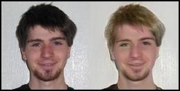
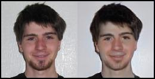
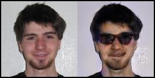
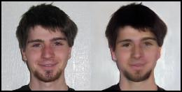
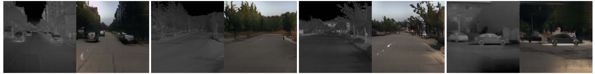
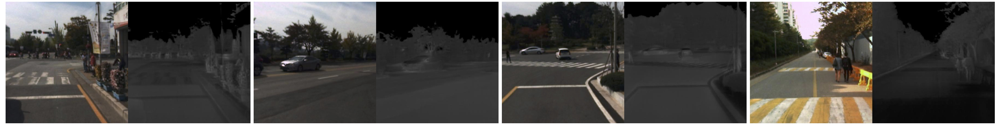
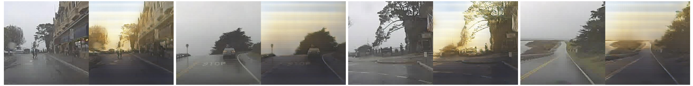
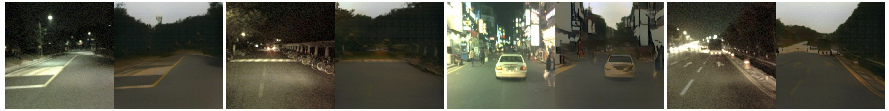
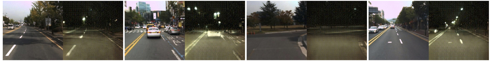
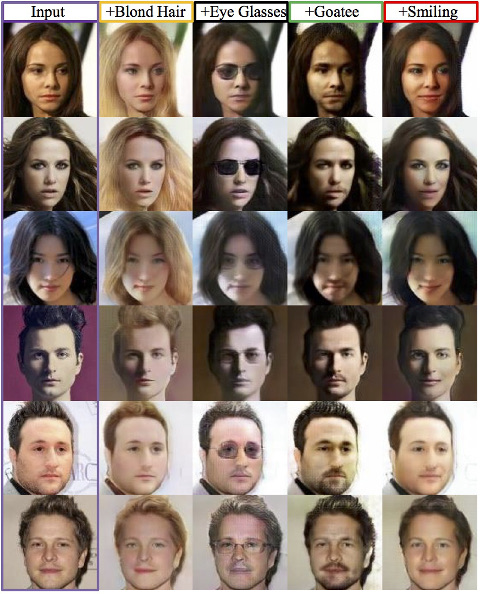

## PyTorch Implementation of the Unsupervised Image-to-Image Translation  (UNIT) Networks

### License

Copyright (C) 2017 NVIDIA Corporation.  All rights reserved.
Licensed under the CC BY-NC-ND 4.0 license (https://creativecommons.org/licenses/by-nc-nd/4.0/legalcode). 


### General
This is a PyTorch implementation of the UNIT algorithm. 
For more details please refer to our [paper](https://arxiv.org/abs/1703.00848).

Ming-Yu Liu, Thomas Breuel, Jan Kautz, "Unsupervised Image-to-Image Translation Networks" arXiv:1703.00848 2017

Please cite our paper if this software is used in your publications.

### Algorithm Overview

Given a dataset of images from one domain and another dataset of images from other domain, UNIT learns to translate an image from one domain to a corresponding image in the other domain without requiring corresponding images in the two domains. In some sense, it tries to learn a joint distribution of images from samples drawn from marginal distributions. In theory, this is not possible without additional assumption. The assumption UNIT makes is the shared latent space assumption. It assumes pairs of corresponding images have the same latent code and implements weight-sharing constraints to enforce this assumption under the unsupervised setting. For more details, please refer to our paper https://arxiv.org/abs/1703.00848.

### Dependency
pytorch, yaml, opencv, and tensorboard (from https://github.com/dmlc/tensorboard).

If you use Anaconda2, then the following commands can be used to install all the dependencies.

```
conda install pytorch torchvision cuda80 -c soumith
conda install -c anaconda yaml=0.1.6
conda install -c menpo opencv=2.4.11
pip install tensorboard
```

### Usage

The scripts are based on our experiments on the [CelebA dataset](http://mmlab.ie.cuhk.edu.hk/projects/CelebA.html).

#### Training
```
python train.py --config ../exps/celeba_blond_hair.yaml --log ../logs;
```
#### Resume training
 ```
python train.py --config ../exps/celeba_blond_hair.yaml --log ../logs --resume 1;
```
#### Testing 

We thank Ian Goodfellow for kindly providing his photo for our demo.

Download pretrained models from https://drive.google.com/drive/folders/0BwpOatrZwxK6STdZcXNNcXpFSHM?usp=sharing and save them in snapshots/ folder.

From no-blond-hair to blond-hair. (Turn blond hair attribute on)
```
./translate_one_image.py --config ../exps/celeba_blond_hair.yaml --image_name ../images/ian.jpg --output_image_name ../results/ian_to_blond_hair.jpg --weights ../snapshots/celeba_blond_hair_gen_00500000.pkl --a2b 0
```


From goatee to non-goatee. (Turn goatee attribute off)
```
./translate_one_image.py --config ../exps/celeba_blond_hair.yaml --image_name ../images/ian.jpg --output_image_name ../results/ian_to_no_goatee.jpg --weights ../snapshots/celeba_goatee_gen_00500000.pkl --a2b 1
```


From no eyeglasses to eyeglasses. (Turn eyeglasses attribute on)
```
./translate_one_image.py --config ../exps/celeba_blond_hair.yaml --image_name ../images/ian.jpg --output_image_name ../results/ian_to_eyeglasses.jpg --weights ../snapshots/celeba_eyeglasses_gen_00500000.pkl --a2b 0
```


From smiling to neutral. (Turn smiling attribute off)
```
./translate_one_image.py --config ../exps/celeba_blond_hair.yaml --image_name ../images/ian.jpg --output_image_name ../results/ian_to_no_smiling.jpg --weights ../snapshots/celeba_smiling_gen_00500000.pkl --a2b 1
```



### Example Results

Left: Input foggy images. Right: Output sunny images. Learning was conducted using SYNTHIA dataset. For videos in the original resolution, check out https://www.youtube.com/watch?v=E6exDXjESHA


[1] thermal IR image to color image translation (Left, input and right, translation.)



[2] rainy day image to sunny day image translation (Left, input and right, translation.)



[3] night time image to day time image translation (Left, input and right, translation.)





### One Example

Training for attribute-based face image translation.

- Step 1. Download the file img_aligned_celeba.zip based on the instructions in [CelebA dataset](http://mmlab.ie.cuhk.edu.hk/projects/CelebA.html) and unzip it to datasets/celeba/img_align_celeba/ folder
- Step 2. Crop and resize CelebA images.
    ```
    cd datasets/celeba/
    ./crop_and_resize.py
    ```
- Step 3. Write an experiment config file. Follow the example config file in exps/celeba_blond_hair.yaml
- Step 4. Training
    ```
    python train.py --config ../exps/celeba_blond_hair.yaml --log ../logs;
    ```
- Step 5. Testing
    ```
    python translate_one_image.py --config ../exps/celeba_blond_hair.yaml --image ../images/032162.jpg --weights ../outputs/celeba_blond_hair/celeba_blond_hair_gen_00500000.pkl --a2b 0 --output ../results/032162_with_blond_hair.jpg
    ```
