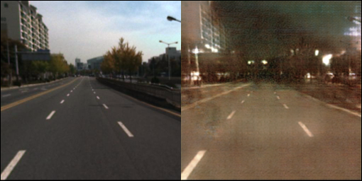
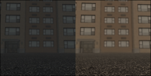
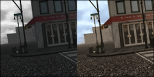
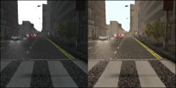
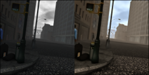

## PyTorch Implementation of the Unsupervised Image-to-Image Translation  (UNIT) Networks

### License

Copyright (C) 2017 NVIDIA Corporation.  All rights reserved.
Licensed under the CC BY-NC-ND 4.0 license (https://creativecommons.org/licenses/by-nc-nd/4.0/legalcode). 


### General
This is a PyTorch implementation of the UNIT algorithm. 
For more details please refer to our [paper](https://arxiv.org/abs/1703.00848).

Ming-Yu Liu, Thomas Breuel, Jan Kautz, "Unsupervised Image-to-Image Translation Networks" arXiv:1703.00848 2017

Please cite our paper if this software is used in your publications.

### Dependency
pytorch, yaml, opencv, and tensorboard (from https://github.com/dmlc/tensorboard).

If you use Anaconda2, then the following commands can be used to install all the dependencies.

```
conda install pytorch torchvision cuda80 -c soumith
conda install -c anaconda yaml=0.1.6
conda install -c menpo opencv=2.4.11
pip install tensorboard
```

### Usage

The scripts are based on our experiments on the [KAIST dataset](https://sites.google.com/site/pedestrianbenchmark/) and [CelebA dataset](http://mmlab.ie.cuhk.edu.hk/projects/CelebA.html).

Training
```
python train.py --config ../exps/kaist_day_and_night.yaml  --log ../logs;
python train.py --config ../exps/celeba_blond_hair.yaml --log ../logs;
```
Resume training
 ```
python train.py --config ../exps/kaist_day_and_night.yaml  --log ../logs --resume 1;
python train.py --config ../exps/celeba_blond_hair.yaml --log ../logs --resume 1;
```
Testing 

Day to Night Translation

```
python translate.py --config ../exps/kaist_day_and_night.yaml --root ../datasets/kaist_multi/ --folder images/ --list images/Day2Night/train_all_day.txt  --weights ../outputs/kaist_day_and_night/kaist_day_and_night_gen_00050000.pkl --a2b 1 --output ../results/ --gpu 0
```

Night to Day Translation

```
python translate.py --config ../exps/kaist_day_and_night.yaml --root ../datasets/kaist_multi/ --folder images/ --list images/Day2Night/train_all_night.txt  --weights ../outputs/kaist_day_and_night/kaist_day_and_night_gen_00050000.pkl --a2b 0 --output ../results/ --gpu 0
```

Non-blond Hair to Blond Hair Translation

```
python translate_one_image.py --config ../exps/celeba_blond_hair.yaml --image ../images/032162.jpg --weights ../outputs/celeba_blond_hair/celeba_blond_hair_gen_00500000.pkl --a2b 0 --output ../results/032162_with_blond_hair.jpg
```

### Example Results

[](https://www.youtube.com/watch?v=okUKH-KXiCY)

[](https://www.youtube.com/watch?v=E6exDXjESHA)[](https://www.youtube.com/watch?v=zfO4msSwrb0)[](https://www.youtube.com/watch?v=BTgA3l9iRWE)[](https://www.youtube.com/watch?v=scnJT1yI95U)


[1] thermal IR image to color image translation (Left, input and right, translation.)


[2] rainy day image to sunny day image translation (Left, input and right, translation.)


[3] night time image to day time image translation (Left, input and right, translation.)


### One Example

Attribute-based face image translation.

- Step 1. Download the file img_aligned_celeba.zip based on the instructions in [CelebA dataset](http://mmlab.ie.cuhk.edu.hk/projects/CelebA.html) and unzip it to datasets/celeba/img_align_celeba/ folder
- Step 2. Crop and resize CelebA images.
    ```
    cd datasets/celeba/
    ./crop_and_resize.py
    ```
- Step 3. Write an experiment config file. Follow the example config file in exps/celeba_blond_hair.yaml
- Step 4. Training
    ```
    python train.py --config ../exps/celeba_blond_hair.yaml --log ../logs;
    ```
- Step 5. Testing
    ```
    python translate_one_image.py --config ../exps/celeba_blond_hair.yaml --image ../images/032162.jpg --weights ../outputs/celeba_blond_hair/celeba_blond_hair_gen_00500000.pkl --a2b 0 --output ../results/032162_with_blond_hair.jpg
    ```